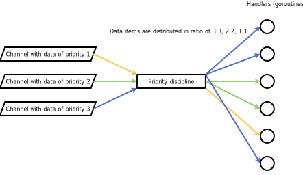
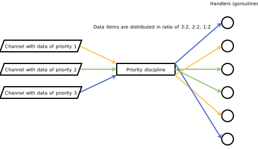
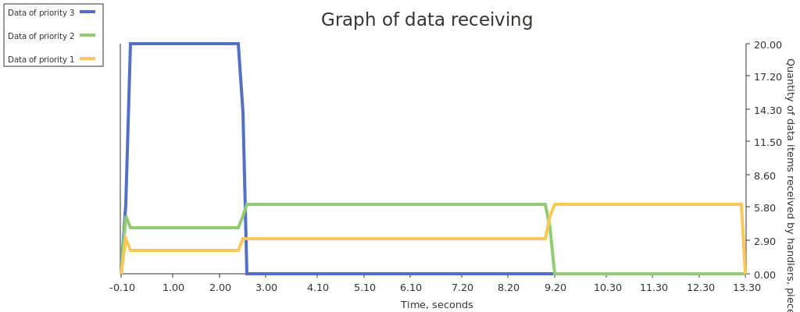
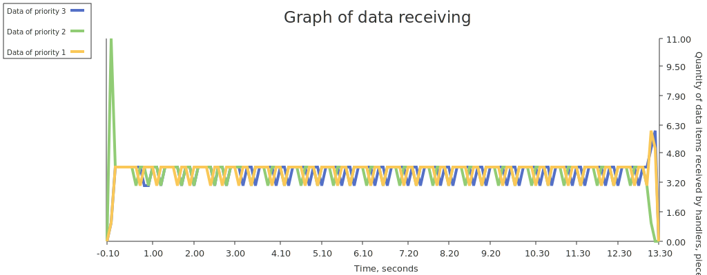

# Priority discipline

## Purpose

Distributes data items between handlers in quantity corresponding to the
 priority of the data items

Also may be used to equaling distribution of data items with different
 processing times

## Principle of operation

* Prioritization:

  

* Equaling:

  

## Comparison with unmanaged distribution

If different times are spent processing data of different priorities, then we
 will get different processing speeds in the case of using the priority
 discipline and without it.

For example, suppose that data of priority 3 is processed in time **T**,
 data of priority 2 is processed in time 5\***T**, and data of priority 1 is
 processed in time 10\***T**, then we will get the following results (quantity
 of processed data and the quantity of handlers are the same in both cases):

* equaling by priority discipline:

  

* unmanaged distribution:

  

It can be seen that with unmanaged distribution, the processing speed of data
 of priority 3 is limited by the slowest processed data (of priority 1 and 2),
 but at with equaling by the priority discipline the processing speed of data
 of priority 3 is no limited by others priorities. Similarly, with unmanaged
 distribution, the processing speed of data of priority 2 is limited by slower
 processed data of priority 1, but there is no such limitation with equaling
 by the priority discipline

## Usage

Example:

```go
package main

import (
    "cmp"
    "fmt"
    "maps"
    "os"
    "slices"
    "strconv"
    "time"

    "github.com/akramarenkov/flow/priority"
    "github.com/akramarenkov/flow/priority/divider"

    "github.com/guptarohit/asciigraph"
)

func main() {
    handlersQuantity := uint(100)
    itemsQuantity := 10000
    // Preferably input channels should be buffered for performance reasons.
    // Optimal capacity is equal to the quantity of data handlers
    inputCapacity := handlersQuantity
    processingDuration := 10 * time.Millisecond
    graphInterval := 100 * time.Millisecond
    graphRangeExtension := 500 * time.Millisecond

    inputs := map[uint]chan int{
        70: make(chan int, inputCapacity),
        20: make(chan int, inputCapacity),
        10: make(chan int, inputCapacity),
    }

    // Used only in this example for measuring receiving of data items
    type measure struct {
        Priority uint
        Time     time.Duration
    }

    compareTime := func(first, second measure) int {
        return cmp.Compare(first.Time, second.Time)
    }

    // Channel capacity is equal to the total quantity of input data in order to
    // minimize delays in collecting measurements
    measurements := make(chan measure, itemsQuantity*len(inputs))

    // For equaling use divider.Fair divider, for prioritization use divider.Rate
    // divider or custom divider
    opts := priority.Opts[int]{
        Divider:          divider.Rate,
        HandlersQuantity: handlersQuantity,
    }

    for prio, channel := range inputs {
        if err := opts.AddInput(prio, channel); err != nil {
            panic(err)
        }
    }

    discipline, err := priority.New(opts)
    if err != nil {
        panic(err)
    }

    // Running writers, that write data items to input channels
    for _, input := range inputs {
        go func() {
            defer close(input)

            for item := range itemsQuantity {
                input <- item
            }
        }()
    }

    startedAt := time.Now()

    // Running handlers, that process data items
    for range handlersQuantity {
        go func() {
            for prioritized := range discipline.Output() {
                // Data item processing
                measurement := measure{
                    Priority: prioritized.Priority,
                    Time:     time.Since(startedAt),
                }

                time.Sleep(processingDuration)

                measurements <- measurement

                // Handlers must call this method after the current
                // data item has been processed
                discipline.Release(prioritized.Priority)
            }
        }()
    }

    // Waiting for completion of the discipline, and also writers and handlers
    if err := <-discipline.Err(); err != nil {
        fmt.Println("An error was received: ", err)
    }

    graphRange := time.Since(startedAt) + graphRangeExtension

    close(measurements)

    received := make(map[uint][]measure, len(inputs))

    // Receiving measurements
    for item := range measurements {
        received[item.Priority] = append(received[item.Priority], item)
    }

    // Sorting measurements by time for further research
    for _, measurements := range received {
        slices.SortFunc(measurements, compareTime)
    }

    // Calculating quantity of data items received by handlers over time
    quantities := make(map[uint][]float64)

    for span := time.Duration(0); span <= graphRange; span += graphInterval {
        for prio, measurements := range received {
            quantity := float64(0)

            for _, measure := range measurements {
                if measure.Time < span-graphInterval {
                    continue
                }

                if measure.Time >= span {
                    break
                }

                quantity++
            }

            quantities[prio] = append(quantities[prio], quantity)
        }
    }

    // Preparing research data for plot
    serieses := make([][]float64, 0, len(quantities))
    legends := make([]string, 0, len(quantities))

    // To keep the legends in the same order
    priorities := slices.SortedFunc(maps.Keys(quantities), priority.Compare)

    for _, prio := range priorities {
        serieses = append(serieses, quantities[prio])
        legends = append(legends, strconv.FormatUint(uint64(prio), 10))
    }

    graph := asciigraph.PlotMany(
        serieses,
        asciigraph.Height(10),
        asciigraph.Caption("Quantity of data items received by handlers over time"),
        asciigraph.SeriesColors(asciigraph.Red, asciigraph.Green, asciigraph.Blue),
        asciigraph.SeriesLegends(legends...),
    )

    _, err = fmt.Fprintln(os.Stderr, graph)
    fmt.Println(err)
    fmt.Println("See graph")
    // Output:
    // <nil>
    // See graph
}
```
